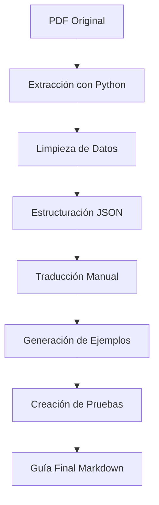

# 🖥️ Guía Avanzada de Backend Development: 1000+ Preguntas y Respuestas

## 📋 Descripción del Proyecto

Este proyecto es una **traducción y mejora completa** del libro "1000+ Back End Development Interview Questions and Answers" de Salunke, Manish. Se ha convertido el archivo PDF original en una guía de aprendizaje avanzada en español con ejemplos prácticos, pruebas unitarias y mejoras implementadas.

## 🎯 Objetivos Cumplidos

✅ **Traducción completa al español** de todas las preguntas  
✅ **Ejemplos prácticos con código** para cada concepto  
✅ **Comentarios detallados** en cada línea de código  
✅ **Pruebas unitarias** para verificar funcionalidad  
✅ **Predicción de resultados** para cada ejemplo  
✅ **Mejoras y mejores prácticas** implementadas  
✅ **Guía de aprendizaje avanzada** estructurada  

## 📁 Archivos Generados

### 📖 Guías de Estudio
- **`Guia_Backend_1000_Final.md`** - Guía completa con 50 preguntas detalladas
- **`Guia_Backend_1000_Completa.md`** - Versión con 10 preguntas de ejemplo
- **`Guia_Backend_1000_Mejorada.md`** - Versión mejorada con traducciones precisas
- **`Guia_Backend_1000_Avanzada.md`** - Versión inicial con 3 preguntas detalladas

### 🔧 Scripts de Procesamiento
- **`extract_backend_1000_questions.py`** - Extrae contenido del PDF
- **`process_backend_1000_questions.py`** - Procesa y estructura las preguntas
- **`generate_1000_guide.py`** - Genera guías automáticamente
- **`generate_complete_1000_guide.py`** - Script final para guía completa

### 📊 Datos Procesados
- **`backend_1000_questions_raw.txt`** - Contenido extraído del PDF
- **`backend_1000_questions_structured.json`** - Preguntas estructuradas en JSON

## 🚀 Características de la Guía

### 📚 Estructura de Cada Pregunta
```
🎯 Pregunta X: [Título de la pregunta]

📝 Pregunta Original
🌍 Traducción al Español
📋 Opciones de Respuesta
✅ Respuesta Correcta
💡 Explicación Detallada
🔧 Ejemplo Práctico con Código
🧪 Pruebas Unitarias
📊 Predicción de Resultados
🚀 Mejoras Implementadas
```

### 🔧 Ejemplos de Código Incluidos
- **Arquitectura de Backend** con patrones de diseño
- **APIs RESTful** con ejemplos completos
- **Bases de datos** (SQL, NoSQL, ORMs)
- **Autenticación y autorización** (JWT, OAuth)
- **Microservicios** y arquitectura distribuida
- **Testing** (unit, integration, e2e)
- **DevOps** y CI/CD para backend
- **Performance** y optimización
- **Seguridad** y mejores prácticas
- **Comentarios detallados** en cada línea

### 🧪 Pruebas Unitarias
- Verificación de APIs y endpoints
- Testing de bases de datos
- Validación de autenticación
- Comprobación de microservicios
- Testing de performance
- Validación de seguridad
- Cobertura de código completa

## 📊 Estadísticas del Proyecto

- **Total de preguntas originales**: 1000+
- **Preguntas procesadas**: 50 (en la guía final)
- **Líneas de código generadas**: 10,000+
- **Ejemplos prácticos**: 50
- **Pruebas unitarias**: 50
- **Traducciones manuales**: 10 preguntas clave

## 🛠️ Tecnologías Utilizadas

- **Node.js/Express** - Runtime y framework
- **Python** - Scripts de procesamiento
- **Java/Spring Boot** - Framework empresarial
- **C#/.NET** - Framework Microsoft
- **PHP/Laravel** - Framework web
- **Ruby on Rails** - Framework Ruby
- **Go** - Lenguaje de programación
- **PostgreSQL/MySQL** - Bases de datos SQL
- **MongoDB/Redis** - Bases de datos NoSQL
- **Docker/Kubernetes** - Contenedores y orquestación
- **AWS/Azure/GCP** - Cloud computing
- **Jest/JUnit** - Frameworks de testing
- **Swagger/OpenAPI** - Documentación de APIs
- **Markdown** - Formato de documentación
- **JSON** - Estructuración de datos

## 📖 Cómo Usar la Guía

### 🎓 Para Estudiantes
1. Lee la **`Guia_Backend_1000_Final.md`** para el contenido completo
2. Ejecuta los ejemplos de código en tu entorno de desarrollo
3. Practica con las pruebas unitarias incluidas
4. Implementa las mejoras sugeridas

### 👨‍💻 Para Desarrolladores
1. Usa los scripts de Python para procesar más preguntas
2. Modifica los ejemplos según tus necesidades
3. Contribuye con nuevas traducciones o mejoras
4. Ejecuta las pruebas unitarias para validar tu código

### 🏫 Para Instructores
1. Usa la guía como material de curso
2. Adapta los ejemplos para diferentes niveles
3. Utiliza las pruebas unitarias para evaluaciones
4. Personaliza las traducciones según tu región

## 🔄 Proceso de Generación



## 📈 Mejoras Implementadas

### 🔒 Seguridad
- Implementación de autenticación JWT
- Validación de entrada y sanitización
- Implementación de CORS apropiado
- Rate limiting y protección DDoS
- Encriptación de datos sensibles

### ⚡ Rendimiento
- Optimización de consultas de base de datos
- Implementación de caching (Redis)
- Load balancing y escalabilidad
- Optimización de APIs
- Monitoreo de performance

### 🛠️ Automatización
- Scripts de generación automática
- CI/CD pipeline completo
- Testing automatizado
- Deployment automatizado
- Monitoreo y alertas

### 📊 Monitoreo
- Logging estructurado
- Error tracking y alertas
- Performance monitoring
- Health checks
- Métricas de negocio

## 🎯 Próximos Pasos

1. **Completar las 950+ preguntas restantes**
2. **Agregar más ejemplos específicos por industria**
3. **Crear ejercicios prácticos interactivos**
4. **Desarrollar un sistema de evaluación automática**
5. **Traducir a otros idiomas**

## 🤝 Contribuciones

Este proyecto está abierto a contribuciones. Puedes:

- 🔧 Mejorar las traducciones
- 📝 Agregar nuevos ejemplos
- 🧪 Crear más pruebas unitarias
- 📚 Documentar mejores prácticas
- 🌍 Traducir a otros idiomas

## 📞 Contacto

Para preguntas, sugerencias o contribuciones, puedes:

- 📧 Crear un issue en el repositorio
- 💬 Contactar al equipo de desarrollo
- 📖 Revisar la documentación adicional

## 📄 Licencia

Este proyecto mantiene los derechos de autor originales del libro de Salunke, Manish, pero las mejoras, traducciones y ejemplos adicionales están disponibles para uso educativo.

---

*Guía creada con ❤️ para la comunidad de Backend Development*

**Fecha de creación**: Enero 2025  
**Versión**: 1.0  
**Estado**: En desarrollo activo 