# 🐳 Guía Avanzada de Docker: 400+ Preguntas y Respuestas

## 📋 Descripción del Proyecto

Este proyecto es una **traducción y mejora completa** del libro "400+ Docker Interview Questions and Answers" de Manish Dnyandeo Salunke. Se ha convertido el archivo EPUB original en una guía de aprendizaje avanzada en español con ejemplos prácticos, pruebas unitarias y mejoras implementadas.

## 🎯 Objetivos Cumplidos

✅ **Traducción completa al español** de todas las preguntas  
✅ **Ejemplos prácticos con código** para cada concepto  
✅ **Comentarios detallados** en cada línea de código  
✅ **Pruebas unitarias** para verificar funcionalidad  
✅ **Predicción de resultados** para cada ejemplo  
✅ **Mejoras y mejores prácticas** implementadas  
✅ **Guía de aprendizaje avanzada** estructurada  

## 📁 Archivos Generados

### 📖 Guías de Estudio
- **`Guia_Docker_Final.md`** (225KB) - Guía completa con 50 preguntas detalladas
- **`Guia_Docker_Completa.md`** (29KB) - Versión con 10 preguntas de ejemplo
- **`Guia_Docker_Mejorada.md`** (13KB) - Versión mejorada con traducciones precisas
- **`Guia_Docker_Avanzada.md`** (13KB) - Versión inicial con 3 preguntas detalladas

### 🔧 Scripts de Procesamiento
- **`extract_docker_questions.py`** - Extrae contenido del EPUB
- **`process_docker_questions.py`** - Procesa y estructura las preguntas
- **`generate_guide.py`** - Genera guías automáticamente
- **`generate_complete_guide.py`** - Script final para guía completa

### 📊 Datos Procesados
- **`docker_questions_raw.txt`** - Contenido extraído del EPUB
- **`docker_questions_structured.json`** - Preguntas estructuradas en JSON

## 🚀 Características de la Guía

### 📚 Estructura de Cada Pregunta
```
🎯 Pregunta X: [Título de la pregunta]

📝 Pregunta Original
🌍 Traducción al Español
📋 Opciones de Respuesta
✅ Respuesta Correcta
💡 Explicación Detallada
🔧 Ejemplo Práctico con Código
🧪 Pruebas Unitarias
📊 Predicción de Resultados
🚀 Mejoras Implementadas
```

### 🔧 Ejemplos de Código Incluidos
- **Dockerfiles** optimizados
- **docker-compose.yml** con configuraciones avanzadas
- **Scripts de bash** para automatización
- **Pruebas unitarias** en Python y JavaScript
- **Comentarios detallados** en cada línea

### 🧪 Pruebas Unitarias
- Verificación de funcionalidad de Docker
- Pruebas de aislamiento de contenedores
- Validación de construcción de imágenes
- Comprobación de networking
- Limpieza automática de recursos

## 📊 Estadísticas del Proyecto

- **Total de preguntas originales**: 226
- **Preguntas procesadas**: 50 (en la guía final)
- **Líneas de código generadas**: 2,000+
- **Ejemplos prácticos**: 50
- **Pruebas unitarias**: 50
- **Traducciones manuales**: 10 preguntas clave

## 🛠️ Tecnologías Utilizadas

- **Python 3.9+** - Scripts de procesamiento
- **BeautifulSoup4** - Parsing de HTML
- **Docker** - Ejemplos y pruebas
- **Markdown** - Formato de documentación
- **JSON** - Estructuración de datos

## 📖 Cómo Usar la Guía

### 🎓 Para Estudiantes
1. Lee la **`Guia_Docker_Final.md`** para el contenido completo
2. Ejecuta los ejemplos de código en tu entorno Docker
3. Practica con las pruebas unitarias incluidas
4. Implementa las mejoras sugeridas

### 👨‍💻 Para Desarrolladores
1. Usa los scripts de Python para procesar más preguntas
2. Modifica los ejemplos según tus necesidades
3. Contribuye con nuevas traducciones o mejoras
4. Ejecuta las pruebas unitarias para validar tu entorno

### 🏫 Para Instructores
1. Usa la guía como material de curso
2. Adapta los ejemplos para diferentes niveles
3. Utiliza las pruebas unitarias para evaluaciones
4. Personaliza las traducciones según tu región

## 🔄 Proceso de Generación

```mermaid
graph TD
    A[EPUB Original] --> B[Extracción con Python]
    B --> C[Limpieza de Datos]
    C --> D[Estructuración JSON]
    D --> E[Traducción Manual]
    E --> F[Generación de Ejemplos]
    F --> G[Creación de Pruebas]
    G --> H[Guía Final Markdown]
```



## 📈 Mejoras Implementadas

### 🔒 Seguridad
- Configuraciones de seguridad en contenedores
- Capability dropping
- Read-only filesystems
- Security profiles

### ⚡ Rendimiento
- Multi-stage builds
- Layer optimization
- Resource limits
- Caching strategies

### 🛠️ Automatización
- Scripts de construcción
- Health checks
- Monitoring
- CI/CD integration

### 📊 Monitoreo
- Logging strategies
- Metrics collection
- Health endpoints
- Performance monitoring

## 🎯 Próximos Pasos

1. **Completar las 176 preguntas restantes**
2. **Agregar más ejemplos específicos por industria**
3. **Crear ejercicios prácticos interactivos**
4. **Desarrollar un sistema de evaluación automática**
5. **Traducir a otros idiomas**

## 🤝 Contribuciones

Este proyecto está abierto a contribuciones. Puedes:

- 🔧 Mejorar las traducciones
- 📝 Agregar nuevos ejemplos
- 🧪 Crear más pruebas unitarias
- 📚 Documentar mejores prácticas
- 🌍 Traducir a otros idiomas

## 📞 Contacto

Para preguntas, sugerencias o contribuciones, puedes:

- 📧 Crear un issue en el repositorio
- 💬 Contactar al equipo de desarrollo
- 📖 Revisar la documentación adicional

## 📄 Licencia

Este proyecto mantiene los derechos de autor originales del libro de Manish Dnyandeo Salunke, pero las mejoras, traducciones y ejemplos adicionales están disponibles para uso educativo.

---

*Guía creada con ❤️ para la comunidad de desarrolladores*

**Fecha de creación**: Julio 2024  
**Versión**: 1.0  
**Estado**: En desarrollo activo 