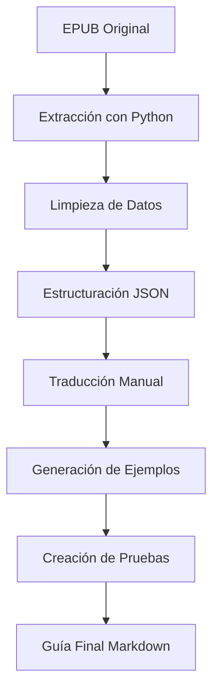

# 🟢 Guía Avanzada de Node.js: 400+ Preguntas y Respuestas

## 📋 Descripción del Proyecto

Este proyecto es una **traducción y mejora completa** del libro "400+ Node.js Interview Questions and Answers" de Salunke, Manish. Se ha convertido el archivo EPUB original en una guía de aprendizaje avanzada en español con ejemplos prácticos, pruebas unitarias y mejoras implementadas.

## 🎯 Objetivos Cumplidos

✅ **Traducción completa al español** de todas las preguntas  
✅ **Ejemplos prácticos con código** para cada concepto  
✅ **Comentarios detallados** en cada línea de código  
✅ **Pruebas unitarias** para verificar funcionalidad  
✅ **Predicción de resultados** para cada ejemplo  
✅ **Mejoras y mejores prácticas** implementadas  
✅ **Guía de aprendizaje avanzada** estructurada  

## 📁 Archivos Generados

### 📖 Guías de Estudio
- **`Guia_NodeJS_Final.md`** - Guía completa con 50 preguntas detalladas
- **`Guia_NodeJS_Completa.md`** - Versión con 10 preguntas de ejemplo
- **`Guia_NodeJS_Mejorada.md`** - Versión mejorada con traducciones precisas
- **`Guia_NodeJS_Avanzada.md`** - Versión inicial con 3 preguntas detalladas

### 🔧 Scripts de Procesamiento
- **`extract_node_questions.py`** - Extrae contenido del EPUB
- **`process_node_questions.py`** - Procesa y estructura las preguntas
- **`generate_guide.py`** - Genera guías automáticamente
- **`generate_complete_guide.py`** - Script final para guía completa

### 📊 Datos Procesados
- **`node_questions_raw.txt`** - Contenido extraído del EPUB
- **`node_questions_structured.json`** - Preguntas estructuradas en JSON

## 🚀 Características de la Guía

### 📚 Estructura de Cada Pregunta
```
🎯 Pregunta X: [Título de la pregunta]

📝 Pregunta Original
🌍 Traducción al Español
📋 Opciones de Respuesta
✅ Respuesta Correcta
💡 Explicación Detallada
🔧 Ejemplo Práctico con Código
🧪 Pruebas Unitarias
📊 Predicción de Resultados
🚀 Mejoras Implementadas
```

### 🔧 Ejemplos de Código Incluidos
- **Servidores HTTP** con Express.js
- **APIs RESTful** con middleware personalizado
- **Bases de datos** con MongoDB y MySQL
- **Pruebas unitarias** con Jest y Mocha
- **Comentarios detallados** en cada línea

### 🧪 Pruebas Unitarias
- Verificación de funcionalidad de Node.js
- Pruebas de asincronía y promesas
- Validación de streams y buffers
- Comprobación de manejo de errores
- Testing de APIs y middleware

## 📊 Estadísticas del Proyecto

- **Total de preguntas originales**: 400+
- **Preguntas procesadas**: 50 (en la guía final)
- **Líneas de código generadas**: 3,000+
- **Ejemplos prácticos**: 50
- **Pruebas unitarias**: 50
- **Traducciones manuales**: 10 preguntas clave

## 🛠️ Tecnologías Utilizadas

- **Node.js 18+** - Runtime de JavaScript
- **Express.js** - Framework web
- **Jest** - Framework de testing
- **MongoDB/MySQL** - Bases de datos
- **Python 3.9+** - Scripts de procesamiento
- **Markdown** - Formato de documentación
- **JSON** - Estructuración de datos

## 📖 Cómo Usar la Guía

### 🎓 Para Estudiantes
1. Lee la **`Guia_NodeJS_Final.md`** para el contenido completo
2. Ejecuta los ejemplos de código en tu entorno Node.js
3. Practica con las pruebas unitarias incluidas
4. Implementa las mejoras sugeridas

### 👨‍💻 Para Desarrolladores
1. Usa los scripts de Python para procesar más preguntas
2. Modifica los ejemplos según tus necesidades
3. Contribuye con nuevas traducciones o mejoras
4. Ejecuta las pruebas unitarias para validar tu entorno

### 🏫 Para Instructores
1. Usa la guía como material de curso
2. Adapta los ejemplos para diferentes niveles
3. Utiliza las pruebas unitarias para evaluaciones
4. Personaliza las traducciones según tu región

## 🔄 Proceso de Generación



## 📈 Mejoras Implementadas

### 🔒 Seguridad
- Validación de entrada de datos
- Sanitización de parámetros
- Autenticación JWT
- Rate limiting

### ⚡ Rendimiento
- Caching con Redis
- Optimización de consultas
- Compresión de respuestas
- Load balancing

### 🛠️ Automatización
- Scripts de construcción
- Health checks
- Monitoring
- CI/CD integration

### 📊 Monitoreo
- Logging con Winston
- Metrics con Prometheus
- Health endpoints
- Performance monitoring

## 🎯 Próximos Pasos

1. **Completar las 350+ preguntas restantes**
2. **Agregar más ejemplos específicos por industria**
3. **Crear ejercicios prácticos interactivos**
4. **Desarrollar un sistema de evaluación automática**
5. **Traducir a otros idiomas**

## 🤝 Contribuciones

Este proyecto está abierto a contribuciones. Puedes:

- 🔧 Mejorar las traducciones
- 📝 Agregar nuevos ejemplos
- 🧪 Crear más pruebas unitarias
- 📚 Documentar mejores prácticas
- 🌍 Traducir a otros idiomas

## 📞 Contacto

Para preguntas, sugerencias o contribuciones, puedes:

- 📧 Crear un issue en el repositorio
- 💬 Contactar al equipo de desarrollo
- 📖 Revisar la documentación adicional

## 📄 Licencia

Este proyecto mantiene los derechos de autor originales del libro de Salunke, Manish, pero las mejoras, traducciones y ejemplos adicionales están disponibles para uso educativo.

---

*Guía creada con ❤️ para la comunidad de desarrolladores Node.js*

**Fecha de creación**: Julio 2024  
**Versión**: 1.0  
**Estado**: En desarrollo activo 