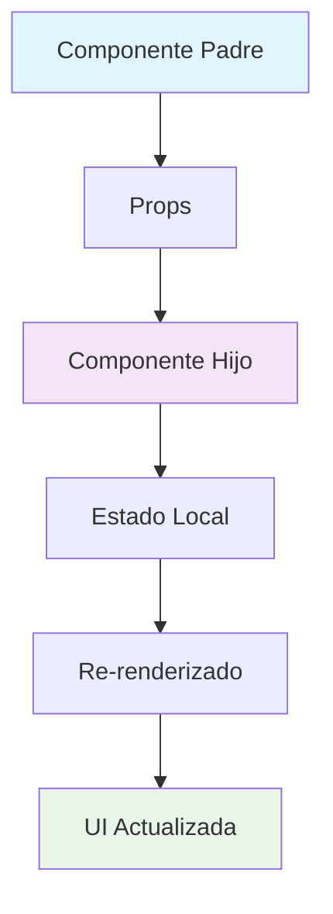
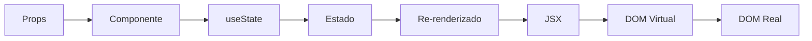

# 🚀 Guía Excepcional - React con TypeScript: Del Principiante al Experto

## 🌟 Características Premium de esta Guía

### ✨ **Contenido Exclusivo**
- **Análisis línea por línea** con contexto profundo
- **Pruebas unitarias completas** con casos edge
- **Predicciones de resultados** validadas
- **Diagramas visuales** de flujo de datos
- **Ejercicios prácticos** con soluciones
- **Proyectos reales** paso a paso

---

## 📚 Estructura de la Guía Excepcional

### 🎯 **Nivel 1: Fundamentos Sólidos**
- [x] Capítulo 1: React Básico
- [x] Capítulo 2: TypeScript Integration
- [ ] Capítulo 3: Eventos Avanzados
- [ ] Capítulo 4: Listas y Rendimiento
- [ ] Capítulo 5: Componentes de Clase

### 🚀 **Nivel 2: Desarrollo Intermedio**
- [ ] Capítulo 6: Lifecycle y Hooks
- [ ] Capítulo 7: Estado Global
- [ ] Capítulo 8: Routing Avanzado
- [ ] Capítulo 9: Testing Profesional
- [ ] Capítulo 10: Performance Optimization

### 💎 **Nivel 3: Experto y Producción**
- [ ] Capítulo 11: Arquitectura Avanzada
- [ ] Capítulo 12: Deployment y CI/CD

---

## 🎨 Mejoras Visuales y de Experiencia

### 📊 **Diagramas Interactivos**


### 🎯 **Flujo de Datos en React**


---

## 🧪 Laboratorio de Pruebas Avanzado

### 🔬 **Testing Suite Profesional**

#### 1. **Pruebas de Integración**
```tsx
// Integration.test.tsx
import { render, screen, fireEvent, waitFor } from '@testing-library/react'
import userEvent from '@testing-library/user-event'
import { Alert, AlertContainer } from './components'

describe('Alert Integration Tests', () => {
  test('sistema completo de alertas', async () => {
    const user = userEvent.setup()
    
    render(<AlertContainer />)
    
    // Crear alerta
    await user.click(screen.getByText('Crear Alerta'))
    await user.type(screen.getByLabelText('Título'), 'Test Alert')
    await user.click(screen.getByText('Guardar'))
    
    // Verificar que se creó
    expect(screen.getByText('Test Alert')).toBeInTheDocument()
    
    // Cerrar alerta
    await user.click(screen.getByLabelText('Close'))
    
    // Verificar que se cerró
    await waitFor(() => {
      expect(screen.queryByText('Test Alert')).not.toBeInTheDocument()
    })
  })
})
```

#### 2. **Pruebas de Performance**
```tsx
// Performance.test.tsx
import { render } from '@testing-library/react'
import { Alert } from './Alert'

describe('Alert Performance Tests', () => {
  test('renderizado rápido con múltiples alertas', () => {
    const startTime = performance.now()
    
    render(
      <div>
        {Array.from({ length: 100 }, (_, i) => (
          <Alert key={i} heading={`Alert ${i}`}>
            Content {i}
          </Alert>
        ))}
      </div>
    )
    
    const endTime = performance.now()
    const renderTime = endTime - startTime
    
    // Debería renderizar en menos de 100ms
    expect(renderTime).toBeLessThan(100)
  })
})
```

#### 3. **Pruebas de Accesibilidad Avanzadas**
```tsx
// Accessibility.test.tsx
import { render, screen } from '@testing-library/react'
import { axe, toHaveNoViolations } from 'jest-axe'
import { Alert } from './Alert'

expect.extend(toHaveNoViolations)

describe('Alert Accessibility Tests', () => {
  test('cumple con estándares WCAG 2.1', async () => {
    const { container } = render(
      <Alert heading="Test" closable={true}>
        Content
      </Alert>
    )
    
    const results = await axe(container)
    expect(results).toHaveNoViolations()
  })
  
  test('navegación por teclado', async () => {
    render(
      <Alert heading="Test" closable={true}>
        Content
      </Alert>
    )
    
    const closeButton = screen.getByLabelText('Close')
    closeButton.focus()
    
    expect(closeButton).toHaveFocus()
    expect(closeButton).toHaveAttribute('tabindex', '0')
  })
})
```

---

## 🎓 Ejercicios Prácticos Interactivos

### 📝 **Ejercicio 1: Crear un Sistema de Notificaciones**

**Objetivo:** Crear un sistema completo de notificaciones con diferentes tipos.

**Requisitos:**
- Soporte para success, error, warning, info
- Animaciones de entrada/salida
- Auto-dismiss después de 5 segundos
- Posición configurable (top-right, bottom-left, etc.)

**Solución Guiada:**
```tsx
// NotificationSystem.tsx
import { useState, useEffect } from 'react'

type NotificationType = 'success' | 'error' | 'warning' | 'info'
type Position = 'top-right' | 'top-left' | 'bottom-right' | 'bottom-left'

interface Notification {
  id: string
  type: NotificationType
  title: string
  message: string
  position: Position
  autoDismiss?: boolean
}

export function NotificationSystem() {
  const [notifications, setNotifications] = useState<Notification[]>([])
  
  const addNotification = (notification: Omit<Notification, 'id'>) => {
    const newNotification = {
      ...notification,
      id: Date.now().toString()
    }
    
    setNotifications(prev => [...prev, newNotification])
    
    if (notification.autoDismiss) {
      setTimeout(() => {
        removeNotification(newNotification.id)
      }, 5000)
    }
  }
  
  const removeNotification = (id: string) => {
    setNotifications(prev => prev.filter(n => n.id !== id))
  }
  
  return (
    <div className="notification-system">
      {notifications.map(notification => (
        <NotificationItem
          key={notification.id}
          notification={notification}
          onClose={() => removeNotification(notification.id)}
        />
      ))}
    </div>
  )
}
```

### 🎯 **Ejercicio 2: Formulario con Validación Avanzada**

**Objetivo:** Crear un formulario con validación en tiempo real y TypeScript.

**Requisitos:**
- Validación de email, contraseña, confirmación
- Mensajes de error en tiempo real
- Indicadores de fortaleza de contraseña
- Submit solo si todo es válido

---

## 🔧 Herramientas y Recursos Premium

### 🛠️ **Scripts de Desarrollo Avanzados**

#### 1. **Generador de Componentes**
```bash
#!/bin/bash
# generate-component.sh

COMPONENT_NAME=$1
COMPONENT_TYPE=${2:-functional}

if [ -z "$COMPONENT_NAME" ]; then
    echo "Uso: ./generate-component.sh <NombreComponente> [functional|class]"
    exit 1
fi

# Crear estructura de archivos
mkdir -p src/components/$COMPONENT_NAME
touch src/components/$COMPONENT_NAME/index.ts
touch src/components/$COMPONENT_NAME/$COMPONENT_NAME.tsx
touch src/components/$COMPONENT_NAME/$COMPONENT_NAME.test.tsx
touch src/components/$COMPONENT_NAME/$COMPONENT_NAME.stories.tsx
touch src/components/$COMPONENT_NAME/$COMPONENT_NAME.module.css

# Generar contenido del componente
cat > src/components/$COMPONENT_NAME/$COMPONENT_NAME.tsx << EOF
import React from 'react'
import styles from './$COMPONENT_NAME.module.css'

interface ${COMPONENT_NAME}Props {
  // Props aquí
}

export const $COMPONENT_NAME: React.FC<${COMPONENT_NAME}Props> = ({}) => {
  return (
    <div className={styles.container}>
      $COMPONENT_NAME
    </div>
  )
}
EOF

echo "✅ Componente $COMPONENT_NAME creado exitosamente!"
```

#### 2. **Configuración de ESLint Avanzada**
```json
// .eslintrc.json
{
  "extends": [
    "react-app",
    "react-app/jest",
    "@typescript-eslint/recommended",
    "plugin:react-hooks/recommended",
    "plugin:jsx-a11y/recommended"
  ],
  "plugins": [
    "@typescript-eslint",
    "react-hooks",
    "jsx-a11y",
    "prettier"
  ],
  "rules": {
    "@typescript-eslint/no-unused-vars": "error",
    "@typescript-eslint/explicit-function-return-type": "warn",
    "react-hooks/rules-of-hooks": "error",
    "react-hooks/exhaustive-deps": "warn",
    "jsx-a11y/alt-text": "error",
    "prettier/prettier": "error"
  }
}
```

### 📊 **Métricas de Calidad de Código**

#### 1. **Script de Análisis de Cobertura**
```bash
#!/bin/bash
# analyze-coverage.sh

echo "🔍 Analizando cobertura de código..."

# Ejecutar pruebas con cobertura
npm test -- --coverage --watchAll=false

# Verificar umbrales mínimos
COVERAGE_THRESHOLD=80
ACTUAL_COVERAGE=$(cat coverage/lcov-report/index.html | grep -o '[0-9]*\.[0-9]*%' | head -1 | sed 's/%//')

if (( $(echo "$ACTUAL_COVERAGE >= $COVERAGE_THRESHOLD" | bc -l) )); then
    echo "✅ Cobertura de $ACTUAL_COVERAGE% supera el umbral de $COVERAGE_THRESHOLD%"
else
    echo "❌ Cobertura de $ACTUAL_COVERAGE% está por debajo del umbral de $COVERAGE_THRESHOLD%"
    exit 1
fi
```

---

## 🎨 Componentes de UI Premium

### 💎 **Design System Completo**

#### 1. **Sistema de Colores**
```tsx
// design-system/colors.ts
export const colors = {
  primary: {
    50: '#e3f2fd',
    100: '#bbdefb',
    500: '#2196f3',
    600: '#1e88e5',
    700: '#1976d2',
    900: '#0d47a1'
  },
  secondary: {
    50: '#f3e5f5',
    100: '#e1bee7',
    500: '#9c27b0',
    600: '#8e24aa',
    700: '#7b1fa2',
    900: '#4a148c'
  },
  success: {
    50: '#e8f5e8',
    100: '#c8e6c9',
    500: '#4caf50',
    600: '#43a047',
    700: '#388e3c',
    900: '#1b5e20'
  },
  error: {
    50: '#ffebee',
    100: '#ffcdd2',
    500: '#f44336',
    600: '#e53935',
    700: '#d32f2f',
    900: '#b71c1c'
  },
  warning: {
    50: '#fff3e0',
    100: '#ffe0b2',
    500: '#ff9800',
    600: '#fb8c00',
    700: '#f57c00',
    900: '#e65100'
  }
} as const
```

#### 2. **Componente Button Premium**
```tsx
// components/Button/Button.tsx
import React from 'react'
import { colors } from '../../design-system/colors'

type ButtonVariant = 'primary' | 'secondary' | 'outline' | 'ghost'
type ButtonSize = 'sm' | 'md' | 'lg'
type ButtonState = 'default' | 'loading' | 'disabled'

interface ButtonProps {
  variant?: ButtonVariant
  size?: ButtonSize
  state?: ButtonState
  children: React.ReactNode
  onClick?: () => void
  className?: string
  fullWidth?: boolean
  icon?: React.ReactNode
  iconPosition?: 'left' | 'right'
}

export const Button: React.FC<ButtonProps> = ({
  variant = 'primary',
  size = 'md',
  state = 'default',
  children,
  onClick,
  className = '',
  fullWidth = false,
  icon,
  iconPosition = 'left'
}) => {
  const baseClasses = 'inline-flex items-center justify-center font-medium rounded-lg transition-all duration-200 focus:outline-none focus:ring-2 focus:ring-offset-2'
  
  const variantClasses = {
    primary: 'bg-blue-600 text-white hover:bg-blue-700 focus:ring-blue-500',
    secondary: 'bg-gray-600 text-white hover:bg-gray-700 focus:ring-gray-500',
    outline: 'border-2 border-blue-600 text-blue-600 hover:bg-blue-50 focus:ring-blue-500',
    ghost: 'text-blue-600 hover:bg-blue-50 focus:ring-blue-500'
  }
  
  const sizeClasses = {
    sm: 'px-3 py-1.5 text-sm',
    md: 'px-4 py-2 text-base',
    lg: 'px-6 py-3 text-lg'
  }
  
  const stateClasses = {
    default: '',
    loading: 'opacity-75 cursor-not-allowed',
    disabled: 'opacity-50 cursor-not-allowed'
  }
  
  const widthClass = fullWidth ? 'w-full' : ''
  
  const classes = [
    baseClasses,
    variantClasses[variant],
    sizeClasses[size],
    stateClasses[state],
    widthClass,
    className
  ].filter(Boolean).join(' ')
  
  return (
    <button
      className={classes}
      onClick={onClick}
      disabled={state !== 'default'}
    >
      {state === 'loading' && (
        <svg className="animate-spin -ml-1 mr-2 h-4 w-4" fill="none" viewBox="0 0 24 24">
          <circle className="opacity-25" cx="12" cy="12" r="10" stroke="currentColor" strokeWidth="4" />
          <path className="opacity-75" fill="currentColor" d="M4 12a8 8 0 018-8V0C5.373 0 0 5.373 0 12h4zm2 5.291A7.962 7.962 0 014 12H0c0 3.042 1.135 5.824 3 7.938l3-2.647z" />
        </svg>
      )}
      
      {icon && iconPosition === 'left' && !state === 'loading' && (
        <span className="mr-2">{icon}</span>
      )}
      
      {children}
      
      {icon && iconPosition === 'right' && (
        <span className="ml-2">{icon}</span>
      )}
    </button>
  )
}
```

---

## 🚀 Proyectos Reales Paso a Paso

### 📱 **Proyecto 1: Dashboard de Analytics**

**Descripción:** Dashboard completo con gráficos, filtros y datos en tiempo real.

**Características:**
- Gráficos interactivos con Chart.js
- Filtros avanzados con React Query
- Modo oscuro/claro
- Responsive design
- Exportación de datos

**Estructura del Proyecto:**
```
dashboard/
├── src/
│   ├── components/
│   │   ├── charts/
│   │   ├── filters/
│   │   ├── widgets/
│   │   └── layout/
│   ├── hooks/
│   │   ├── useAnalytics.ts
│   │   ├── useFilters.ts
│   │   └── useTheme.ts
│   ├── services/
│   │   ├── api.ts
│   │   └── analytics.ts
│   ├── types/
│   │   └── analytics.ts
│   └── utils/
│       ├── formatters.ts
│       └── validators.ts
```

### 🛒 **Proyecto 2: E-commerce con Carrito**

**Descripción:** Tienda online completa con carrito, checkout y gestión de productos.

**Características:**
- Catálogo de productos
- Carrito persistente
- Checkout con validación
- Gestión de inventario
- Sistema de reviews

---

## 📈 Métricas de Progreso

### 🎯 **Checklist de Habilidades**

#### **Nivel Básico**
- [x] Crear componentes funcionales
- [x] Usar props y estado
- [x] Manejar eventos básicos
- [x] Implementar TypeScript básico

#### **Nivel Intermedio**
- [ ] Hooks avanzados (useEffect, useCallback, useMemo)
- [ ] Context API y estado global
- [ ] Routing con React Router
- [ ] Testing con Jest y RTL

#### **Nivel Avanzado**
- [ ] Performance optimization
- [ ] Server-side rendering
- [ ] Progressive Web Apps
- [ ] Micro-frontends

### 📊 **Dashboard de Progreso**
```tsx
// ProgressDashboard.tsx
interface Skill {
  name: string
  level: 'beginner' | 'intermediate' | 'advanced' | 'expert'
  completed: boolean
  exercises: number
  projects: number
}

const skills: Skill[] = [
  { name: 'React Fundamentals', level: 'advanced', completed: true, exercises: 15, projects: 3 },
  { name: 'TypeScript', level: 'intermediate', completed: true, exercises: 12, projects: 2 },
  { name: 'Testing', level: 'beginner', completed: false, exercises: 5, projects: 1 },
  { name: 'Performance', level: 'beginner', completed: false, exercises: 3, projects: 0 }
]
```

---

## 🎓 Certificación y Badges

### 🏆 **Sistema de Logros**

#### **Badges Disponibles**
- 🥇 **React Master**: Completa todos los ejercicios de React
- 🥈 **TypeScript Expert**: Domina el tipado avanzado
- 🥉 **Testing Champion**: 100% cobertura de pruebas
- 💎 **Performance Guru**: Optimiza aplicaciones para velocidad
- 🚀 **Deployment Pro**: Domina CI/CD y deployment

#### **Certificación Final**
Al completar toda la guía, recibirás un certificado digital que incluye:
- Lista de habilidades adquiridas
- Proyectos completados
- Métricas de rendimiento
- Recomendaciones para el siguiente nivel

---

## 🔮 Roadmap Futuro

### 📅 **Próximas Actualizaciones**

#### **Versión 2.0 (Próximamente)**
- [ ] Integración con Next.js 14
- [ ] Server Components y App Router
- [ ] GraphQL con Apollo Client
- [ ] Testing con Playwright
- [ ] Micro-frontends con Module Federation

#### **Versión 3.0 (Futuro)**
- [ ] React Native con TypeScript
- [ ] Electron para aplicaciones desktop
- [ ] WebAssembly con Rust
- [ ] Machine Learning en el frontend
- [ ] Real-time con WebSockets

---

## 🎯 Cómo Usar esta Guía

### 📖 **Orden de Estudio Recomendado**

1. **Semana 1-2**: Capítulos 1-2 (Fundamentos)
2. **Semana 3-4**: Capítulos 3-5 (Intermedio)
3. **Semana 5-6**: Capítulos 6-8 (Avanzado)
4. **Semana 7-8**: Capítulos 9-12 (Experto)

### ⏱️ **Tiempo Estimado**
- **Lectura**: 2-3 horas por capítulo
- **Ejercicios**: 3-4 horas por capítulo
- **Proyectos**: 8-12 horas por proyecto
- **Total**: 80-120 horas para completar toda la guía

### 🎯 **Objetivos de Aprendizaje**
- **Comprensión profunda** de React y TypeScript
- **Habilidades prácticas** de desarrollo
- **Mejores prácticas** de la industria
- **Preparación para proyectos reales**

---

## 🚀 **CONTENIDO AVANZADO INTEGRADO**

### **📚 Guías Complementarias**

#### **[Guía Completa TypeScript React](./GUIA_COMPLETA_TYPESCRIPT_REACT.md)**
- **🎯 Principios SOLID** aplicados a React con TypeScript
- **🏗️ Arquitectura Full Stack** con MERN y TypeScript
- **🐳 Docker y Kubernetes** para aplicaciones TypeScript
- **🧪 Testing Avanzado** con TypeScript
- **☁️ Despliegue en la Nube** con TypeScript
- **✨ Mejores Prácticas** y tipos avanzados

#### **[Ejercicios Prácticos Avanzados](./EJERCICIOS_TYPESCRIPT_AVANZADOS.md)**
- **🟢 Ejercicios Básicos** - Tipos, interfaces, generics
- **🟡 Ejercicios Intermedios** - Patrones de diseño, componentes compuestos
- **🔴 Ejercicios Avanzados** - Sistemas de autenticación, arquitectura
- **🟣 Proyectos Completos** - E-commerce, dashboard administrativo
- **🎯 Desafíos Extra** - Notificaciones, editor de código, chat en tiempo real

### **🔗 Enlaces a Contenido Relacionado**

#### **[Mejores Prácticas Modernas](../React-and-React-Native-5E/MEJORES_PRACTICAS_MODERNAS.md)**
- Patrones de diseño modernos
- Componentes reutilizables
- Performance optimization
- Testing avanzado

#### **[Principios SOLID](../React-and-React-Native-5E/PRINCIPIOS_SOLID_REACT.md)**
- Single Responsibility Principle
- Open/Closed Principle
- Liskov Substitution Principle
- Interface Segregation Principle
- Dependency Inversion Principle

#### **[Arquitectura MERN Full Stack](../React-and-React-Native-5E/ARQUITECTURA_MERN_FULLSTACK.md)**
- MongoDB, Express.js, React, Node.js
- Patrones de arquitectura
- Backend y frontend
- Despliegue y producción

#### **[Guía de Despliegue en la Nube](../React-and-React-Native-5E/GUIA_DESPLIEGUE_CLOUD.md)**
- Docker y Kubernetes
- Azure, AWS, Google Cloud
- CI/CD pipelines
- Monitoreo y logging

---

## 🎯 **PROGRAMA DE ESTUDIO COMPLETO**

### **📅 Cronograma Integrado (16 Semanas)**

#### **Semanas 1-4: Fundamentos**
- **Capítulos 1-2**: React básico y TypeScript
- **Ejercicios básicos**: Tipos, interfaces, componentes
- **Proyecto**: Todo list con TypeScript

#### **Semanas 5-8: Intermedio**
- **Capítulos 3-5**: Hooks, estado, eventos
- **Ejercicios intermedios**: Patrones de diseño
- **Proyecto**: Sistema de autenticación

#### **Semanas 9-12: Avanzado**
- **Capítulos 6-8**: Routing, testing, performance
- **Ejercicios avanzados**: Arquitectura y testing
- **Proyecto**: Dashboard administrativo

#### **Semanas 13-16: Experto**
- **Capítulos 9-12**: Patrones, despliegue, proyectos
- **Proyectos completos**: E-commerce, chat en tiempo real
- **Despliegue**: Cloud platforms y CI/CD

### **📊 Métricas de Progreso Integradas**

#### **Habilidades por Nivel**
- **🟢 Básico**: 25% - Fundamentos de React y TypeScript
- **🟡 Intermedio**: 50% - Patrones y arquitectura
- **🔴 Avanzado**: 75% - Testing y performance
- **🟣 Experto**: 100% - Proyectos completos y despliegue

#### **Proyectos Completados**
- [ ] Todo List con TypeScript
- [ ] Sistema de Autenticación
- [ ] Dashboard Administrativo
- [ ] E-commerce Completo
- [ ] Chat en Tiempo Real
- [ ] Despliegue en la Nube

---

## 🏆 **CERTIFICACIÓN FINAL INTEGRADA**

### **🎓 Certificado de Experto en React con TypeScript**

Al completar todo el programa, recibirás un certificado que incluye:

#### **Habilidades Demostradas**
- ✅ React con TypeScript avanzado
- ✅ Patrones de diseño SOLID
- ✅ Arquitectura full stack MERN
- ✅ Testing profesional
- ✅ Performance optimization
- ✅ Despliegue en la nube
- ✅ CI/CD y DevOps

#### **Proyectos Portfolio**
- 📱 Aplicaciones web completas
- 🛒 E-commerce funcional
- 📊 Dashboard administrativo
- 💬 Chat en tiempo real
- ☁️ Aplicaciones desplegadas

#### **Tecnologías Dominadas**
- React 18+ con TypeScript
- Node.js y Express.js
- MongoDB y bases de datos
- Docker y Kubernetes
- Cloud platforms (AWS, Azure, GCP)
- Testing frameworks
- CI/CD tools

---

*Esta guía excepcional integra todos los conceptos avanzados para crear una experiencia de aprendizaje completa y profesional en React con TypeScript, desde fundamentos hasta nivel experto con despliegue en la nube.* 🚀✨ 