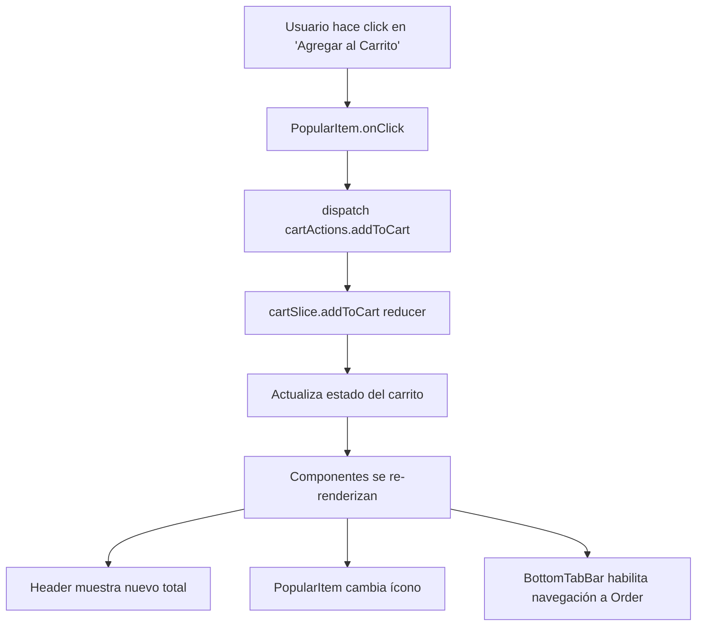

# Código Detallado de Mesio - Food Delivery App

## Resumen Ejecutivo

**Mesio** es una aplicación de entrega de comida desarrollada con **Next.js 15** y **React 19**, implementando una arquitectura moderna basada en componentes, hooks personalizados y gestión de estado con Redux Toolkit. Esta documentación explica en detalle cómo funciona cada parte del código con ejemplos prácticos y entendibles.

## 1. Estructura de la Aplicación

### 1.1 Layout Principal (RootLayout)

El `RootLayout` es el componente raíz que envuelve toda la aplicación:

```typescript
// src/app/layout.tsx
export default function RootLayout({
  children,
}: Readonly<{
  children: React.ReactNode;
}>) {
  return (
    <html lang="en">
      <body className={`${roboto.variable}`}>
        <StoreProvider>
          <BurgerContacts />
          {children}
        </StoreProvider>
      </body>
    </html>
  );
}
```

**¿Qué hace?**
- Configura la fuente Roboto para toda la aplicación
- Proporciona el store de Redux a todos los componentes hijos
- Incluye el menú lateral de contactos en todas las páginas
- Renderiza el contenido específico de cada página (`children`)

**Ejemplo Práctico:**
```typescript
// Cuando navegas a /home, el layout renderiza:
<RootLayout>
  <Home /> {/* Este es el children */}
</RootLayout>

// Cuando navegas a /shop, el layout renderiza:
<RootLayout>
  <Shop /> {/* Este es el children */}
</RootLayout>
```

### 1.2 Proveedor del Store (StoreProvider)

El `StoreProvider` configura Redux para toda la aplicación:

```typescript
// src/app/StoreProvider.tsx
export default function StoreProvider({children}: {children: React.ReactNode}) {
  const storeRef = useRef<AppStore | null>(null);
  
  if (!storeRef.current) {
    storeRef.current = makeStore(); // Crea el store solo una vez
  }

  return <Provider store={storeRef.current}>{children}</Provider>;
}
```

**¿Por qué useRef?**
- Evita recrear el store en cada renderizado
- Mantiene la misma instancia del store durante toda la vida de la aplicación
- Mejora el rendimiento

**Ejemplo de Uso:**
```typescript
// Cualquier componente hijo puede acceder al store:
const {cart, wishlist} = useAppSelector((state) => state);
const dispatch = useAppDispatch();

// Agregar al carrito
dispatch(cartActions.addToCart(dish));
```

## 2. Página Principal (Home)

### 2.1 Estructura del Componente Home

El componente `Home` es la página principal que muestra categorías, platos populares y recomendados:

```typescript
// src/app/home/Home.tsx
export const Home: React.FC = () => {
  const {data, isLoading} = hooks.useGetDishes();

  if (isLoading) return <components.Loader />;

  const categories = data
    ? Array.from(new Set(data.map((dish: DishType) => dish.category)))
    : [];

  return (
    <components.MotionWrapper>
      <components.SafeAreaView>
        {renderHeader()}
        {renderContent()}
        {renderBottomBar()}
      </components.SafeAreaView>
    </components.MotionWrapper>
  );
};
```

**Flujo de Datos:**
1. **useGetDishes()** obtiene los platos de la API
2. **isLoading** muestra un spinner mientras carga
3. **categories** extrae categorías únicas de los platos
4. **renderContent()** muestra las secciones principales

### 2.2 Renderizado de Categorías

```typescript
const renderCategories = () => {
  return (
    <div style={{marginBottom: 30}}>
      <Swiper
        spaceBetween={10}
        slidesPerView={'auto'}
        pagination={{clickable: true}}
        mousewheel={true}
      >
        {categories?.map((category: any) => (
          <SwiperSlide key={category.id} style={{width: 'auto'}}>
            <Link href={`${constants.routes.shopCategory}/${category.toLowerCase()}`}>
              <span>{category}</span>
            </Link>
          </SwiperSlide>
        ))}
      </Swiper>
    </div>
  );
};
```

**¿Qué hace Swiper?**
- Crea un carrusel horizontal deslizable
- `slidesPerView: 'auto'` ajusta el ancho automáticamente
- `mousewheel: true` permite navegar con la rueda del mouse
- Cada categoría es un slide clickeable

**Ejemplo Visual:**
```
[Pizza] [Hamburguesas] [Sushi] [Pasta] [Ensaladas]
   ↑         ↑           ↑       ↑        ↑
Click → Navega a /shop-category/pizza
```

### 2.3 Renderizado de Platos Populares

```typescript
const renderPopular = () => {
  return (
    <section style={{marginBottom: 30}}>
      <components.BlockHeading
        title="Popular Dishes"
        href={`${constants.routes.shop}/popular`}
      />
      <Swiper spaceBetween={14} slidesPerView={'auto'}>
        {data
          ?.filter((dish: DishType) => dish.isPopular)
          .map((dish: DishType) => (
            <SwiperSlide key={dish.id} style={{width: 'auto'}}>
              <items.PopularItem dish={dish} key={dish.id} />
            </SwiperSlide>
          ))}
      </Swiper>
    </section>
  );
};
```

**Filtrado de Datos:**
- `data?.filter((dish) => dish.isPopular)` - Solo platos marcados como populares
- `map()` crea un componente `PopularItem` para cada plato
- Swiper los organiza en un carrusel horizontal

## 3. Componentes de UI

### 3.1 Header (Encabezado)

El `Header` es el componente de navegación superior:

```typescript
// src/components/Header.tsx
export const Header: React.FC<Props> = ({
  title,
  showGoBack,
  showBasket,
  showBurger,
  titleStyle,
}) => {
  const router = useRouter();
  const dispatch = useAppDispatch();
  const {total, list: cart} = useAppSelector((state) => state.cart);
  const {isOpen} = useAppSelector((state) => state.modalSlice);

  return (
    <header style={{
      position: 'fixed',
      top: 0,
      left: '50%',
      transform: 'translateX(-50%)',
      width: '100%',
      zIndex: 3,
      height: constants.sizes.headerHeight,
      backgroundColor: constants.colors.whiteColor,
    }}>
      {renderBurger()}
      {renderTitle()}
      {renderBasket()}
    </header>
  );
};
```

**Funcionalidades del Header:**

#### Botón de Menú (Burger)
```typescript
const renderBurger = () => {
  if (!showBurger) return null;
  
  return (
    <button onClick={() => {
      dispatch(modalActions.setIsOpen(!isOpen));
    }}>
      <svg.BurgerSvg />
    </button>
  );
};
```

**¿Qué hace?**
- Abre/cierra el menú lateral
- `!isOpen` alterna el estado del modal
- Solo se muestra si `showBurger={true}`

#### Carrito de Compras
```typescript
const renderBasket = () => {
  if (!showBasket) return null;
  
  return (
    <button onClick={() => {
      if (cart.length > 0) {
        router.push(constants.routes.order);
      }
    }}>
      <div style={{
        backgroundColor: constants.colors.redColor,
        borderRadius: 10,
        position: 'absolute',
        top: 18,
        right: 34,
      }}>
        <span>${total > 0 ? total.toFixed(2) : '0'}</span>
      </div>
      <svg.ShoppingBagSvg />
    </button>
  );
};
```

**Características:**
- Muestra el total del carrito en un badge rojo
- Solo navega al carrito si hay items
- Badge posicionado absolutamente sobre el ícono

### 3.2 Barra de Navegación Inferior (BottomTabBar)

```typescript
// src/components/BottomTabBar.tsx
export const BottomTabBar: React.FC = () => {
  const router = useRouter();
  const pathname = usePathname();
  const {list: cart} = useAppSelector((state) => state.cart);
  const {list: wishlist} = useAppSelector((state) => state.wishlist);

  return (
    <footer style={{
      backgroundColor: 'var(--main-dark-color)',
      borderRadius: 70,
      display: 'grid',
      gridTemplateColumns: 'repeat(4, 1fr)',
    }}>
      {constants.tabs.map((tab, index) => (
        <button
          key={index}
          onClick={() => {
            if (cart.length === 0 && tab.route === constants.routes.order) {
              router.push(constants.routes.cartEmpty);
              return;
            }
            router.push(tab.route);
          }}
        >
          <tab.icon color={getTabColor(tab)} />
        </button>
      ))}
    </footer>
  );
};
```

**Navegación Inteligente:**
- Si el carrito está vacío y quieres ir a "Order" → redirige a "Cart Empty"
- Si la wishlist está vacía y quieres ir a "Wishlist" → redirige a "Wishlist Empty"
- Navegación directa en otros casos

**Ejemplo de Tabs:**
```typescript
// src/constants/tabs.tsx
export const tabs = [
  {
    route: '/',
    icon: HomeSvg,
    label: 'Home'
  },
  {
    route: '/shop',
    icon: ShopSvg,
    label: 'Shop'
  },
  {
    route: '/order',
    icon: OrderSvg,
    label: 'Order'
  },
  {
    route: '/wishlist',
    icon: WishlistSvg,
    label: 'Wishlist'
  }
];
```

## 4. Componentes de Items

### 4.1 PopularItem (Item Popular)

```typescript
// src/items/PopularItem.tsx
export const PopularItem: React.FC<Props> = ({dish}) => {
  const dispatch = useAppDispatch();
  const {list: cart} = useAppSelector((state) => state.cart);
  const {list: wishlist} = useAppSelector((state) => state.wishlist);
  
  const isInWishlist = wishlist.some((item) => item.id === dish.id);
  const inCart = cart.find((item) => item.id === dish?.id);

  return (
    <Link href={`${constants.routes.dish}/${dish.id}`}>
      
      <h2>{dish.name}</h2>
      <components.Rating rating={dish.rating} />
      <span>${dish.price?.toFixed(2)}</span>
      
      {/* Botón Agregar al Carrito */}
      <button onClick={(e) => {
        e.stopPropagation();
        e.preventDefault();
        dispatch(cartActions.addToCart(dish));
      }}>
        <components.AddToCartIcon inCart={inCart ? true : false} />
      </button>
      
      {/* Botón Wishlist */}
      <button onClick={(e) => {
        e.stopPropagation();
        e.preventDefault();
        if (isInWishlist) {
          dispatch(wishlistActions.removeFromWishlist(dish));
        } else {
          dispatch(wishlistActions.addToWishlist(dish));
        }
      }}>
        <svg.WishlistAddSvg color={isInWishlist ? 'red' : 'gray'} />
      </button>
    </Link>
  );
};
```

**Funcionalidades del Item:**

#### Estado del Item
```typescript
// Verifica si el plato está en el carrito
const inCart = cart.find((item) => item.id === dish?.id);

// Verifica si el plato está en la wishlist
const isInWishlist = wishlist.some((item) => item.id === dish.id);
```

#### Botones de Acción
- **Agregar al Carrito**: Cambia el ícono según si está en el carrito
- **Wishlist**: Cambia de color (rojo si está, gris si no)
- **stopPropagation()**: Evita que el click del botón active el link del item

**Ejemplo Visual:**
```
┌─────────────────────┐
│    🍕 Pizza        │
│   ⭐⭐⭐⭐⭐ 4.8    │
│      $15.99        │
│ [🛒] [❤️]         │
└─────────────────────┘
```

## 5. Gestión de Estado (Redux)

### 5.1 Store Principal

```typescript
// src/lib/store.tsx
export const makeStore = () => {
  return configureStore({
    reducer: {
      cart: cartSlice.reducer,
      modalSlice: modalSlice.reducer,
      wishlist: wishlistSlice.reducer,
    },
  });
};
```

**Estructura del Store:**
```typescript
{
  cart: {
    total: 0,           // Total con descuentos
    list: [],           // Lista de platos
    delivery: 0,        // Costo de entrega
    discount: 0,        // Porcentaje de descuento
    subtotal: 0,        // Total sin descuentos
    promoCode: '',      // Código promocional
    discountAmount: 0,  // Monto del descuento
  },
  wishlist: {
    list: [],           // Lista de platos favoritos
  },
  modalSlice: {
    isOpen: false,      // Estado del menú lateral
  }
}
```

### 5.2 CartSlice (Lógica del Carrito)

```typescript
// src/lib/cartSlice.tsx
export const cartSlice = createSlice({
  name: 'cart',
  initialState,
  reducers: {
    addToCart: (state, action: PayloadAction<DishType>) => {
      const inCart = state.list.find((item) => item.id === action.payload.id);

      if (inCart) {
        // Si ya está en el carrito, incrementar cantidad
        inCart.quantity += 1;
        state.subtotal += Number(action.payload.price);
      } else {
        // Si no está, agregarlo con cantidad 1
        state.list.push({
          ...action.payload,
          quantity: 1,
        });
        state.subtotal += Number(action.payload.price);
      }
      
      // Recalcular total con descuento
      state.total = state.subtotal * (1 - state.discount / 100);
    },
    
    removeFromCart: (state, action: PayloadAction<DishType>) => {
      const inCart = state.list.find((item) => item.id === action.payload.id);

      if (inCart) {
        if (inCart.quantity > 1) {
          // Si hay más de 1, decrementar
          inCart.quantity -= 1;
        } else {
          // Si solo hay 1, remover del carrito
          state.list.splice(state.list.indexOf(inCart), 1);
        }
        
        state.subtotal -= Number(action.payload.price);
        state.total = state.subtotal * (1 - state.discount / 100);
      }
    },
  },
});
```

**Ejemplo de Uso:**
```typescript
// En un componente
const dispatch = useAppDispatch();

// Agregar al carrito
dispatch(cartActions.addToCart(pizza));

// Remover del carrito
dispatch(cartActions.removeFromCart(pizza));

// Aplicar descuento del 20%
dispatch(cartActions.setDiscount(20));

// Limpiar carrito
dispatch(cartActions.resetCart());
```

## 6. Hooks Personalizados

### 6.1 useGetDishes

```typescript
// src/hooks/useGetDishes.tsx
export const useGetDishes = () => {
  const [data, setData] = useState<DishType[]>([]);
  const [isLoading, setIsLoading] = useState(true);

  const getDishes = async () => {
    try {
      setIsLoading(true);
      const response = await axios.get(URLS.GET_DISHES);
      const dishes = response.data.dishes || response.data || [];
      setData(dishes);
    } catch (error) {
      console.error('API request failed:', error);
      throw error;
    } finally {
      setIsLoading(false);
    }
  };

  useEffect(() => {
    getDishes();
  }, []);

  return {data, isLoading};
};
```

**¿Cómo Funciona?**
1. **Estado inicial**: `data = []`, `isLoading = true`
2. **useEffect**: Ejecuta `getDishes()` cuando el componente se monta
3. **API call**: Hace request a la API de platos
4. **Actualización**: Actualiza `data` y `isLoading`
5. **Retorno**: Devuelve `{data, isLoading}` para usar en el componente

**Uso en Componente:**
```typescript
const Home = () => {
  const {data, isLoading} = useGetDishes();

  if (isLoading) return <Loader />;
  
  return (
    <div>
      {data.map(dish => (
        <DishItem key={dish.id} dish={dish} />
      ))}
    </div>
  );
};
```

### 6.2 useFormField

```typescript
// src/hooks/useFormField.tsx
export const useFormField = (initialValue: string = '') => {
  const [value, setValue] = useState(initialValue);
  const [error, setError] = useState<string | null>(null);

  const handleChange = (newValue: string) => {
    setValue(newValue);
    if (error) setError(null); // Limpiar error al escribir
  };

  const validate = (validator: (value: string) => boolean, errorMessage: string) => {
    if (!validator(value)) {
      setError(errorMessage);
      return false;
    }
    return true;
  };

  return {value, error, handleChange, validate, setError};
};
```

**Ejemplo de Uso:**
```typescript
const LoginForm = () => {
  const email = useFormField('');
  const password = useFormField('');

  const handleSubmit = () => {
    const isEmailValid = email.validate(
      (value) => /^[^\s@]+@[^\s@]+\.[^\s@]+$/.test(value),
      'Email inválido'
    );
    
    const isPasswordValid = password.validate(
      (value) => value.length >= 6,
      'Contraseña debe tener al menos 6 caracteres'
    );

    if (isEmailValid && isPasswordValid) {
      // Enviar formulario
    }
  };

  return (
    <form onSubmit={handleSubmit}>
      <input
        value={email.value}
        onChange={(e) => email.handleChange(e.target.value)}
        placeholder="Email"
      />
      {email.error && <span className="error">{email.error}</span>}
      
      <input
        type="password"
        value={password.value}
        onChange={(e) => password.handleChange(e.target.value)}
        placeholder="Contraseña"
      />
      {password.error && <span className="error">{password.error}</span>}
      
      <button type="submit">Iniciar Sesión</button>
    </form>
  );
};
```

## 7. Constantes y Configuración

### 7.1 Rutas de la Aplicación

```typescript
// src/constants/routes.tsx
export const routes = {
  home: '/home',
  shop: '/shop',
  dish: '/dish',
  order: '/order',
  wishlist: '/wishlist',
  checkout: '/checkout',
  profile: '/profile',
  // ... más rutas
} as const;
```

**Uso en Componentes:**
```typescript
import {constants} from '@/constants';

// Navegar a una ruta
router.push(constants.routes.shop);

// Construir ruta dinámica
const dishUrl = `${constants.routes.dish}/${dish.id}`;
// Resultado: /dish/123
```

### 7.2 Colores y Estilos

```typescript
// src/constants/colors.tsx
export const colors = {
  mainDarkColor: '#1A1D1F',
  textColor: '#6C7275',
  redColor: '#FE724E',
  seaGreenColor: '#4CAF50',
  whiteColor: '#FFFFFF',
} as const;
```

**Uso en Componentes:**
```typescript
import {constants} from '@/constants';

const buttonStyle = {
  backgroundColor: constants.colors.redColor,
  color: constants.colors.whiteColor,
};
```

## 8. Flujo de Datos Completo

### 8.1 Ejemplo: Agregar Plato al Carrito



**Código del Flujo:**
```typescript
// 1. Usuario hace click
<button onClick={() => dispatch(cartActions.addToCart(dish))}>
  Agregar al Carrito
</button>

// 2. Se ejecuta el reducer
addToCart: (state, action) => {
  const inCart = state.list.find(item => item.id === action.payload.id);
  
  if (inCart) {
    inCart.quantity += 1; // Incrementar cantidad
  } else {
    state.list.push({...action.payload, quantity: 1}); // Agregar nuevo
  }
  
  state.subtotal += action.payload.price;
  state.total = state.subtotal * (1 - state.discount / 100);
}

// 3. El estado se actualiza automáticamente
// 4. Todos los componentes que usan el estado se re-renderizan
```

### 8.2 Ejemplo: Navegación Inteligente

```typescript
// En BottomTabBar
const handleTabClick = (tab) => {
  if (cart.length === 0 && tab.route === constants.routes.order) {
    // Carrito vacío → ir a página de carrito vacío
    router.push(constants.routes.cartEmpty);
    return;
  }
  
  if (wishlist.length === 0 && tab.route === constants.routes.wishlist) {
    // Wishlist vacía → ir a página de wishlist vacía
    router.push(constants.routes.wishlistEmpty);
    return;
  }
  
  // Navegación normal
  router.push(tab.route);
};
```

## 9. Patrones de Diseño Implementados

### 9.1 Container/Presentational Pattern

```typescript
// Container Component (Home.tsx)
export const Home = () => {
  const {data, isLoading} = useGetDishes(); // Lógica de negocio
  
  if (isLoading) return <Loader />;
  
  return (
    <div>
      <Header />
      <CategorySlider categories={extractCategories(data)} />
      <PopularDishes dishes={filterPopular(data)} />
      <RecommendedDishes dishes={filterRecommended(data)} />
      <BottomTabBar />
    </div>
  );
};

// Presentational Component (PopularItem.tsx)
export const PopularItem = ({dish, onAddToCart, onToggleWishlist}) => {
  // Solo renderiza UI, no tiene lógica de negocio
  return (
    <div>
      
      <h3>{dish.name}</h3>
      <button onClick={() => onAddToCart(dish)}>
        Agregar al Carrito
      </button>
    </div>
  );
};
```

### 9.2 Custom Hooks Pattern

```typescript
// Hook reutilizable
export const useCart = () => {
  const dispatch = useAppDispatch();
  const {list, total} = useAppSelector(state => state.cart);
  
  const addToCart = (dish) => dispatch(cartActions.addToCart(dish));
  const removeFromCart = (dish) => dispatch(cartActions.removeFromCart(dish));
  const clearCart = () => dispatch(cartActions.resetCart());
  
  return {
    items: list,
    total,
    addToCart,
    removeFromCart,
    clearCart,
    isEmpty: list.length === 0,
    itemCount: list.reduce((sum, item) => sum + item.quantity, 0)
  };
};

// Uso en múltiples componentes
const Header = () => {
  const {total, itemCount} = useCart();
  return <div>Carrito: {itemCount} items - ${total}</div>;
};

const CartPage = () => {
  const {items, clearCart} = useCart();
  return (
    <div>
      {items.map(item => <CartItem key={item.id} item={item} />)}
      <button onClick={clearCart}>Limpiar Carrito</button>
    </div>
  );
};
```

## 10. Ejemplos de Uso Práctico

### 10.1 Crear un Nuevo Componente de Item

```typescript
// src/items/SimpleDishItem.tsx
export const SimpleDishItem: React.FC<{dish: DishType}> = ({dish}) => {
  const {addToCart, isInCart} = useCart();
  const {addToWishlist, removeFromWishlist, isInWishlist} = useWishlist();

  return (
    <div className="dish-item">
      
      <h3>{dish.name}</h3>
      <p>{dish.description}</p>
      <div className="price">${dish.price}</div>
      
      <div className="actions">
        <button 
          onClick={() => addToCart(dish)}
          className={isInCart(dish.id) ? 'in-cart' : ''}
        >
          {isInCart(dish.id) ? 'En Carrito' : 'Agregar al Carrito'}
        </button>
        
        <button 
          onClick={() => isInWishlist(dish.id) 
            ? removeFromWishlist(dish) 
            : addToWishlist(dish)
          }
          className={isInWishlist(dish.id) ? 'in-wishlist' : ''}
        >
          {isInWishlist(dish.id) ? '❤️' : '🤍'}
        </button>
      </div>
    </div>
  );
};
```

### 10.2 Crear un Hook Personalizado

```typescript
// src/hooks/useLocalStorage.ts
export const useLocalStorage = <T>(key: string, initialValue: T) => {
  const [storedValue, setStoredValue] = useState<T>(() => {
    try {
      const item = window.localStorage.getItem(key);
      return item ? JSON.parse(item) : initialValue;
    } catch (error) {
      console.error(error);
      return initialValue;
    }
  });

  const setValue = (value: T | ((val: T) => T)) => {
    try {
      const valueToStore = value instanceof Function ? value(storedValue) : value;
      setStoredValue(valueToStore);
      window.localStorage.setItem(key, JSON.stringify(valueToStore));
    } catch (error) {
      console.error(error);
    }
  };

  return [storedValue, setValue] as const;
};

// Uso
const [theme, setTheme] = useLocalStorage('theme', 'light');
const [userPreferences, setUserPreferences] = useLocalStorage('preferences', {});
```

## Conclusión

La aplicación Mesio implementa una arquitectura moderna y escalable con:

- **Componentes reutilizables** que separan lógica de presentación
- **Hooks personalizados** que encapsulan lógica común
- **Gestión de estado centralizada** con Redux Toolkit
- **Patrones de diseño** que promueven mantenibilidad
- **TypeScript** para mayor seguridad y desarrollo eficiente

El código está diseñado para ser fácil de entender, mantener y extender, siguiendo las mejores prácticas de React y Next.js.
